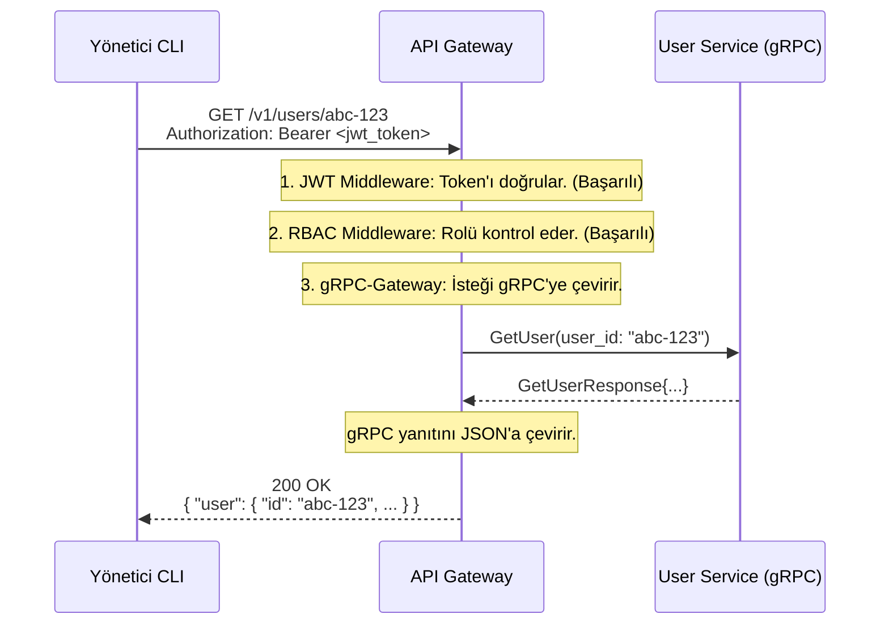

# 🚪 Sentiric API Gateway Service - Mantık ve Akış Mimarisi

**Belge Amacı:** Bu doküman, `api-gateway-service`'in Sentiric platformunun **"güvenli ön kapısı"** olarak stratejik rolünü, bir isteği nasıl işlediğini ve dış dünya (REST API) ile iç dünya (gRPC) arasında nasıl bir tercüman ve güvenlik bekçisi görevi gördüğünü açıklar.

---

## 1. Stratejik Rol: "Güvenlik Bekçisi ve Protokol Tercümanı"

Bu servis, tüm harici istemcilerin (Yönetici Paneli, CLI, Müşteri SDK'ları) platformla konuştuğu tek ve merkezi giriş noktasıdır.

**Bu servis sayesinde platform:**
1.  **Güvenli Olur:** Tüm kimlik doğrulama (Authentication) ve yetkilendirme (Authorization) işlemleri tek bir yerde, bu serviste yapılır. İçerideki mikroservislerin (`user-service`, `dialplan-service` vb.) bu karmaşıklıkla uğraşmasına gerek kalmaz; onlar sadece güvenilir ve doğrulanmış istekleri alırlar.
2.  **Basit ve Tutarlı Olur:** Dış dünyaya, modern ve anlaşılır bir REST API sunar. İçerideki gRPC tabanlı mimarinin karmaşıklığını dış istemcilerden tamamen soyutlar.
3.  **Dayanıklı Olur:** Hız sınırlama (Rate Limiting) ve önbellekleme (Caching) gibi mekanizmaları merkezi olarak uygulayarak, hem kötü niyetli saldırılara karşı koruma sağlar hem de arka uç servislerin yükünü azaltır.

---

## 2. Temel Çalışma Prensibi: Middleware Zinciri ve gRPC-Gateway

Servis, gelen her HTTP isteğini bir "middleware zincirinden" geçirerek işler ve ardından `grpc-gateway`'i kullanarak isteği doğru iç servise yönlendirir.

*   **İstek Alma:** Dış istemciden bir `GET /v1/users/{id}` gibi bir REST isteği gelir.
*   **Middleware 1: Kimlik Doğrulama (JWT):** Servis, `Authorization: Bearer <token>` başlığını kontrol eder. Token geçerli değilse, isteği hemen `401 Unauthorized` hatasıyla reddeder.
*   **Middleware 2: Yetkilendirme (RBAC):** Token geçerliyse, içindeki rolleri (`claims`) çıkarır. Örneğin, "admin" rolüne sahip olmayan bir kullanıcının `/v1/tenants` endpoint'ine erişmeye çalıştığını tespit ederse, isteği `403 Forbidden` hatasıyla reddeder.
*   **Yönlendirme (gRPC-Gateway):** İstek tüm güvenlik kontrollerinden geçerse, `grpc-gateway` devreye girer. Gelen HTTP isteğini (`GET /v1/users/{id}`), ilgili Protobuf tanımına göre bir gRPC isteğine (`GetUserRequest{user_id: "..."}`) dönüştürür.
*   **İç Çağrı:** Bu gRPC isteğini, mTLS ile güvenli bir şekilde, doğru iç servise (`user-service`) iletir.
*   **Yanıt Dönüşümü:** `user-service`'ten gelen gRPC yanıtını (`GetUserResponse{...}`) tekrar JSON formatına çevirir ve dış istemciye HTTP yanıtı olarak gönderir.

---

## 3. Uçtan Uca İstek Akışı: Bir Kullanıcı Bilgisinin Alınması

